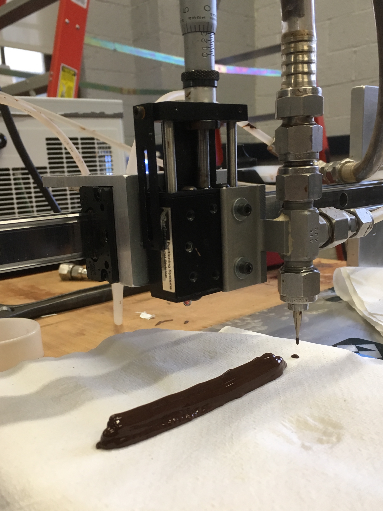

For my Chemical Engineering capstone design project, my teammates and I investigated fluid and thermodynamic properties of chocolate in order to improve upon 3D Printing of chocolate.

Currently, 3D Printing is a relatively novel idea in the food industry, but it can be helpful in automating processes like making chocolates in batches. There are 3D printers designed for chocolate in the market, but all of them come with extremely specific temperature and speed parameters for printing chocolate.

My team and I sought to improve upon the printing process by investigating the optimal flow parameters for printing chocolate. To do so, we designed a simple 3D Printer for chocolate that went back and forth in a straight line. To keep the chocolate warm enough to print, we used a double pipe heat exchange system where the chocolate was surrounded by warm water to keep it at a consistent temperature. To test out which combination of flow parameters worked best for the printer, we varied the extrusion rate (rate of chocolate coming out of a nozzle) and the linear rate at which the chocolate was moving back and forth. 

Ultimately, we concluded that the volumetric flow rate of chocolate coming out of the nozzle head should be as similar as possible to the velocity of the nozzle moving back and forth. 

  
