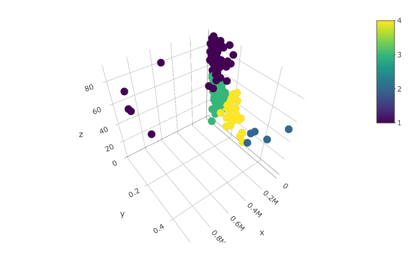
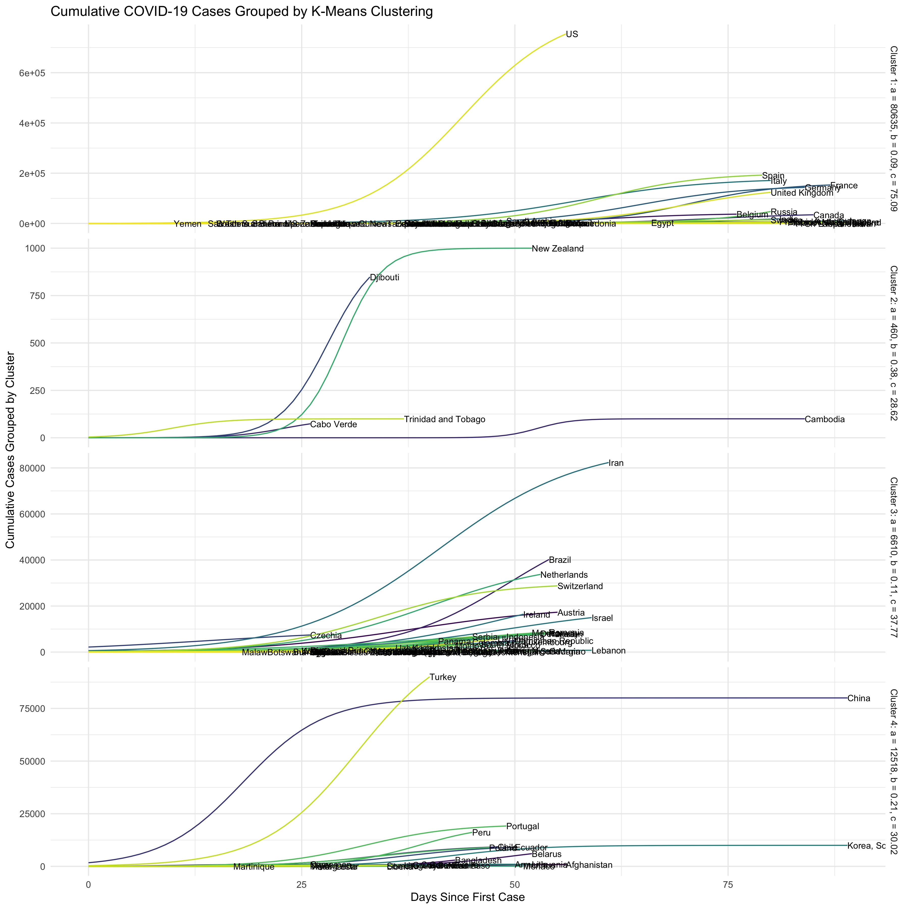
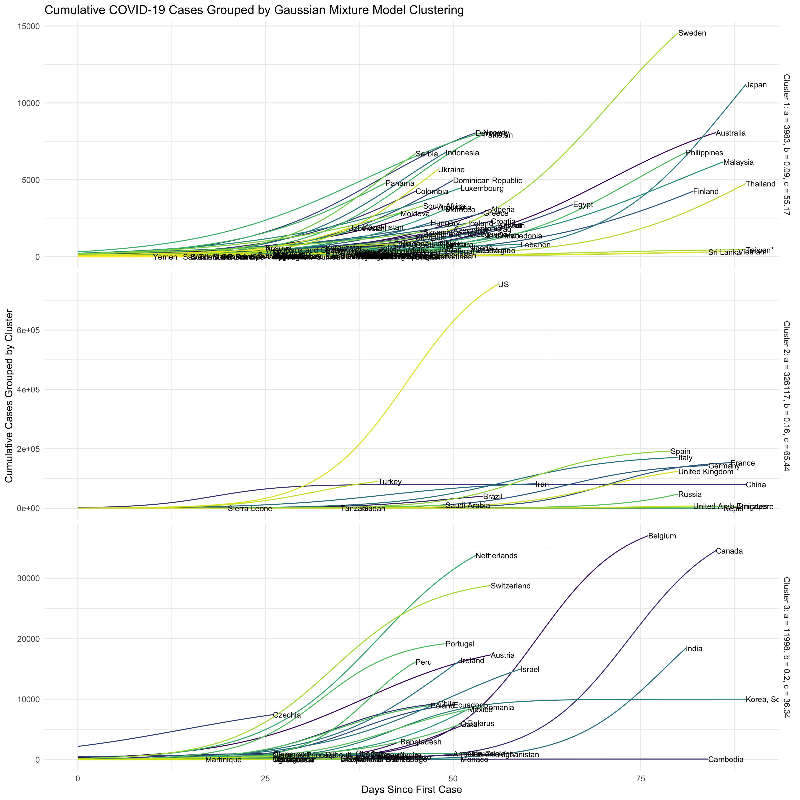

During Spring 2020, my Advanced Topics in Statistical Computing class worked on a timely project to model and visualize coronavirus cases around the world. We took real data from the [Github repository](https://github.com/CSSEGISandData/COVID-19) created by Johns Hopkins University to create an exponential model of cumulative cases, then visualize them based on similarities.

Our goal was to come up with values for the parameters a, b, and c for the following equation that would provide an exponential fit of the coronavirus data for each country:

$$
f(t) = \frac{a}{1 + e^{-b(t-c)}}
$$

where $a$ is the maximum number of cases a region can reach, $b$ is the growth rate of the number of cases, and $c$ is the mid-point in time, where the curve changes from convex to concave.

To create the exponential model, we used a coordinate-wise optimization to minimize the loss function of the exponential equation and determine values of a, b, and c for every country. We then fit the model for every country and compared the model to the real data, as shown below for 4 select countries:

  

  

To get a sense of which countries had similarities in their trajectories, we also clustered the data using K-means clustering and Gaussian Mixture Model clustering. While the number of clusters for these are a bit arbitrary, we decided to use 4 clusters for K-means clustering, and 3 clusters for GMM. 3D plots of the clustering results are shown below.

  

    

    
    <figcaption>K-Means Clustering with K = 4</figcaption>
    

    

    
    <figcaption>GMM Clustering with 3 Clusters</figcaption>
    

  

The graphs below show the results of the clustering by stratifying the exponential models of each country based on their cluster. The graphs can be interpreted based on the average values for each cluster listed on the side of each stratification.

 

  
  <figcaption>Exponential Models with K-Means Clustering</figcaption>
   
  
  <figcaption>Exponential Models with GMM Clustering</figcaption>

 