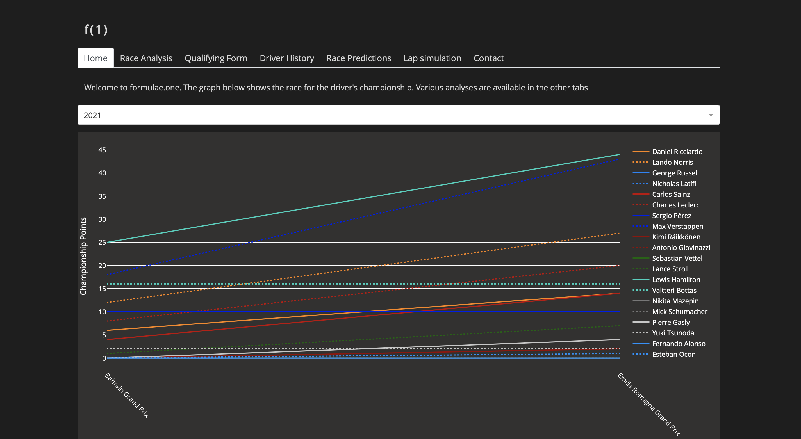

[Pieter de Buck](pieterdebuck.com) and I created a website, Formulae One, which provides analysis on Formula One races. The website features graphs on lap times throughout the race and during qualifications, driver histories, predictions for race outcomes, and lap simulations.

You can check out the website [here](formulae.one).

  