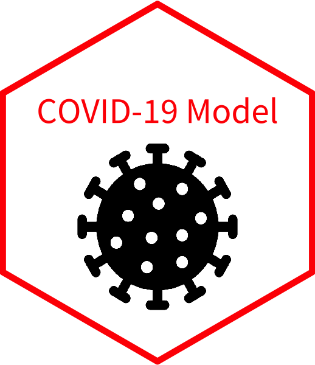

<head>
<!-- Global site tag (gtag.js) - Google Analytics -->

</head>

<!--   
 -->
<!--  -->
<!-- 
   -->

My name is Adeline Shin and I am a first year M.S. Biostatistics student at Columbia Mailman School of Public Health. I am from San Diego, CA, and I graduated in May from Carnegie Mellon University with a B.S. in Chemical Engineering and Biomedical Engineering, as well as a minor in Drama.

  

  

  

  

   

I am passionate about finding creative solutions that can improve health outcomes for everyone, and not just the average individual. My interests lie at the intersection of Health Data Science, Biomedical Engineering, and Precision Medicine. Particularly, I am interested in how we can harness the power of data from wearable devices such as accelerometers, smartwaches, and smartphones to improve the future of healthcare.

You can check out some of my previous projects and work in the other tabs.
 

**Contact Information**  
Adeline Shin  
(858) 405-9664  
as5951@cumc.columbia.edu  
adelineshin2015@gmail.com
