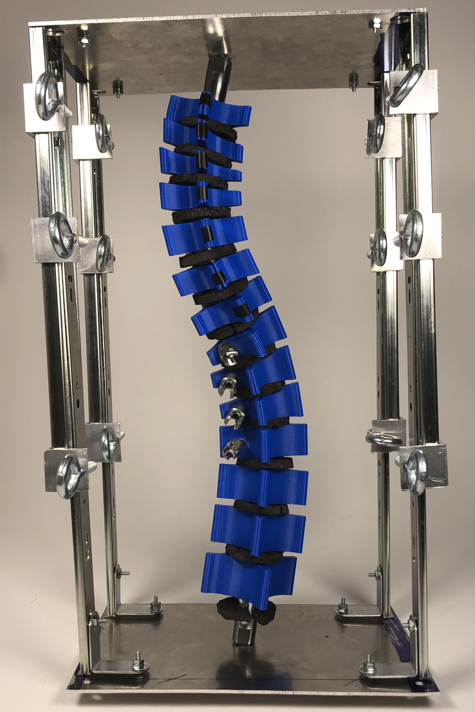

  

During my senior year of college, I worked on a Biomedical Engineering capstone project with Medtronic. My team and I created a scoliosis simulator that modeled Adolescent Idiopathic Scoliosis (AIS) and allowed Medtronic engineers to test new surgical instruments as well as surgeons to try out surgical techniques. 

AIS currently affects 4% of adolescents in America, and those with spine curves greater than 45 degrees need surgical correction. With current technology, it is difficult to test new instrumentation or techniques for AIS surgery, since the only available option is cadaver testing. However, it is extremely hard to come by cadavers with such a high degree of scoliosis, so the simulator that our team created fills the gap in this area.

To create the model, our team went through iterations of prototypes and materials selection to create a tool that was mechanically and anatomically accurate in representing AIS. The model is also compatible with current Medtronic surgical tools, and has been tested by orthopedic surgeons for mechanical accuracy.

Ultimately, our model can help to improve surgical outcomes for AIS by allowing for testing of new techniques and tools before performing surgery on patients for the first time. The video below demonstrates our engineering process as well as the prototype in action.

<iframe src="https://www.youtube.com/embed/1rs4q47CEg0" width="560" height="315" frameborder="0" allow="accelerometer; autoplay; encrypted-media; gyroscope; picture-in-picture" allowfullscreen></iframe>

  
