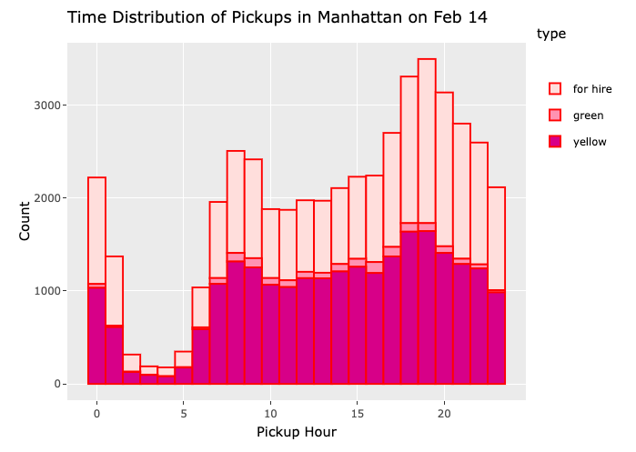
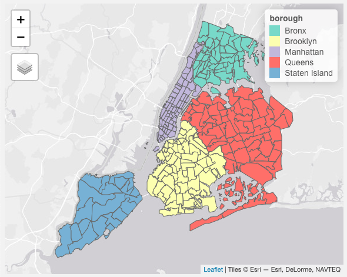

In my Data Science I class at Columbia, I worked with a team on a final project that involved analyzing taxi data on Valentine's Day in 2019. Our data for analysis included yellow cabs, green cabs, as well as rideshare services (Lyft, Uber), and it was found on the NYC Taxi and Limousine website.

We thought that Valentine's Day would be a particularly interesting day to analyze, since people are likely to have plans for a nice dinner or night out, and they are likely to use taxis rather than the subway. We wanted to use the data to see if we could observe any trends in terms of pickup or dropoff neighborhoods, congestion, and the busiest times of the day. Some sample visualizations can be found at the bottom of this page.

These analyses were done with visualizations using ggplot, plotly for interactive graphs and maps, shiny extensions, and a website. The [website](https://abcdefg781.github.io/ds_final_project/) also contains a video walkthrough and more about the background of this project.

I was mainly involved with creating time distribution graphs and an interactive map of the different taxi zones. Below is an image of a time distribution graph, which shows all taxi rides within Manhattan throughout the day. As shown, there is a peak during dinner time, between 6-9 pm, which could possibly be from taxi pickups for Valentine's Day dinner.

  

Another aspect of our project involved translating taxi zone codes to actual neighborhoods. The NYC TLC Data contained numerical zones for neighborhood, and those needed to be converted. In order to help visualize where each neighborhood is, I created an interactive map that contained each zone and its corresponding neighborhood name and borough. The interactive version can be found [here](https://abcdefg781.github.io/ds_final_project/dashboard.html), but a screenshot is provided below.

  

