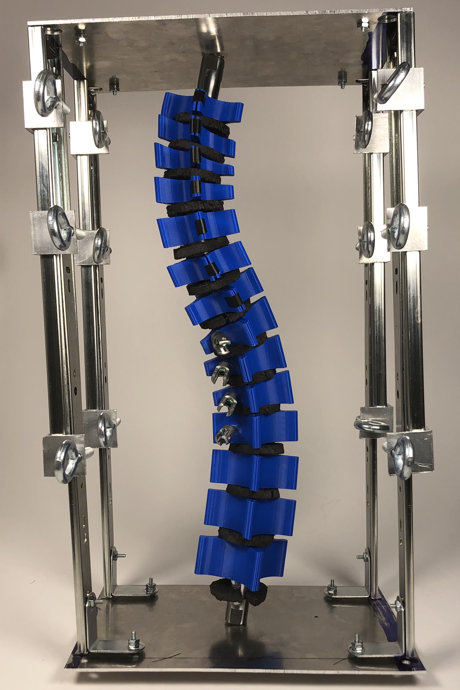

# Medtronic Scoliosis Simulator

  

During my senior year of college, I worked on a Biomedical Engineering capstone project with Medtronic. My team and I created a scoliosis simulator that modeled Adolescent Idiopathic Scoliosis (AIS) and allowed Medtronic engineers to test new surgical instruments as well as surgeons to try out surgical techniques. 

AIS currently affects 4% of adolescents in America, and those with spine curves greater than 45 degrees need surgical correction. With current technology, it is difficult to test new instrumentation or techniques for AIS surgery, since the only available option is cadaver testing. However, it is extremely hard to come by cadavers with such a high degree of scoliosis, so the simulator that our team created fills the gap in this area.

To create the model, our team went through iterations of prototypes and materials selection to create a tool that was mechanically and anatomically accurate in representing AIS. The model is also compatible with current Medtronic surgical tools, and has been tested by orthopedic surgeons for mechanical accuracy.

Ultimately, our model can help to improve surgical outcomes for AIS by allowing for testing of new techniques and tools before performing surgery on patients for the first time. The video below demonstrates our engineering process as well as the prototype in action.

<iframe src="https://www.youtube.com/embed/1rs4q47CEg0" width="560" height="315" frameborder="0" allow="accelerometer; autoplay; encrypted-media; gyroscope; picture-in-picture" allowfullscreen></iframe>

  

# ChocLine Printer
For my Chemical Engineering capstone design project, my teammates and I investigated fluid and thermodynamic properties of chocolate in order to improve upon 3D Printing of chocolate.

Currently, 3D Printing is a relatively novel idea in the food industry, but it can be helpful in automating processes like making chocolates in batches. There are 3D printers designed for chocolate in the market, but all of them come with extremely specific temperature and speed parameters for printing chocolate.

My team and I sought to improve upon the printing process by investigating the optimal flow parameters for printing chocolate. To do so, we designed a simple 3D Printer for chocolate that went back and forth in a straight line. To keep the chocolate warm enough to print, we used a double pipe heat exchange system where the chocolate was surrounded by warm water to keep it at a consistent temperature. To test out which combination of flow parameters worked best for the printer, we varied the extrusion rate (rate of chocolate coming out of a nozzle) and the linear rate at which the chocolate was moving back and forth. 

Ultimately, we concluded that the volumetric flow rate of chocolate coming out of the nozzle head should be as similar as possible to the velocity of the nozzle moving back and forth. 

  
